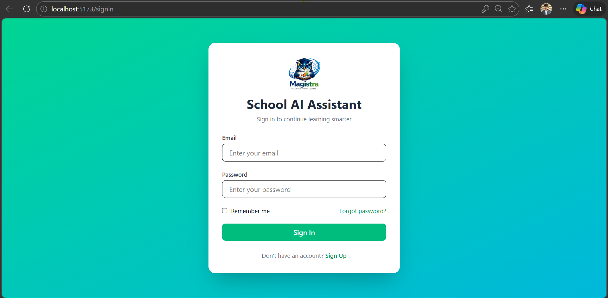
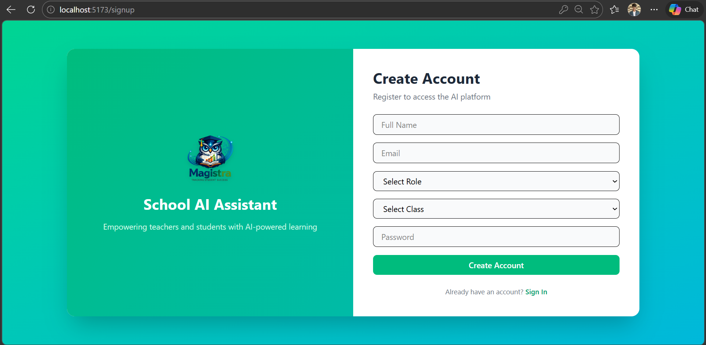
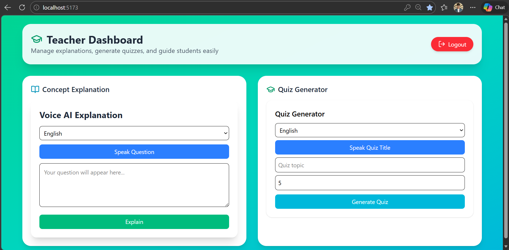

# 🎓 AI Teacher Assistant (Magistra)

> Empowering teachers and students with AI-driven learning 🚀

---

## 📌 Overview

**AI Teacher Assistant (Magistra)** is a web-based platform built during **Hack-A-League 4.0**, a 24-hour national-level hackathon.  
The goal of this project is to **support school teachers—especially in government schools—by leveraging AI to enhance teaching efficiency and student understanding.**

---

## 🚀 Problem Statement

Many schools face:
- Limited teaching resources  
- High student-to-teacher ratio  
- Lack of personalized learning  

👉 This project solves these issues using AI-powered assistance.

---

## 💡 Solution

We built an AI-powered system that helps teachers:

### 🧠 Concept Explanation
- AI generates clear explanations
- Voice input supported

### 📝 Quiz Generator
- Auto-generates quizzes from topics
- Custom number of questions

### 🎤 Voice AI
- Speech-to-text input
- Easy and accessible interface

---

## 🖥️ Features

- 🔐 Authentication (Login / Signup)
- 👨‍🏫 Teacher Dashboard
- 🎙️ Voice AI explanation
- 📚 Quiz generation
- ⚡ Responsive UI
- 🌐 Scalable system

---

## 🏗️ Tech Stack

### Frontend
- React.js  
- Tailwind CSS  
- Axios  
- React Router  

### Backend
- Node.js  
- Express.js  

### Database
- MongoDB  

### AI Integration
- Gemini API  

### Other Tools
- JWT Authentication  
- Speech Recognition API  
- Git & GitHub  

---

## ⚙️ Installation & Setup

### 1. Clone the repository
```bash
git clone https://github.com/Kishore-Student/Magistra.git
cd Magistra
```
### 2. Backend setup
```bash
cd server
npm install
npm start
```

### 3. Frontend setup
```bash
cd frontend
npm install
npm run dev
```

### 🔑 Environment Variables
Create a .env file in backend:
```bash
PORT=5000
MONGO_URI=your_mongodb_connection
JWT_SECRET=your_secret_key
GEMINI_API_URL=your_api_key
```
## 📸 Screenshots

### 🔐 Login Page


### 📝 Signup Page


### 📊 Teacher Dashboard


## 👥 Team

| Name | GitHub | LinkedIn |
|------|--------|----------|
| Shakthivel K | [GitHub](https://github.com/Shakthivelk24) | [LinkedIn](https://www.linkedin.com/in/shakthi-vel-k-b35484343) |
| Kishore S | [GitHub](https://github.com/Kishore-Student) |[LinkedIn](https://www.linkedin.com/in/kishore-s-086140306/)|
| Venkatesh Raju | [GitHub](https://github.com/36venky) | [LinkedIn](https://www.linkedin.com/in/venkatesh-raju-233764311/)|
| Ranna ✮ | [GitHub](https://github.com/rannatxt) | [LinkedIn](https://www.linkedin.com/in/ranna-%E2%9C%AE-1401372a6/) |

## 🏆 Hackathon

Participated in:

Hack-A-League 4.0 <br>
📍 National Level | ⏱️ 24 Hours

Theme: Ignite The Future

## 🌟 Impact

This project aims to:

- Improve quality of education
- Assist teachers with limited resources
- Enable scalable AI-driven learning

## 🤝 Contributing

Contributions are welcome!
Feel free to fork the repo and submit a pull request.

## ❤️ Acknowledgment

Thanks to the organizers of Hack-A-League 4.0 for providing an amazing platform to innovate and build impactful solutions.

## 🔗 Connect

If you like this project, don’t forget to ⭐ the repo!


